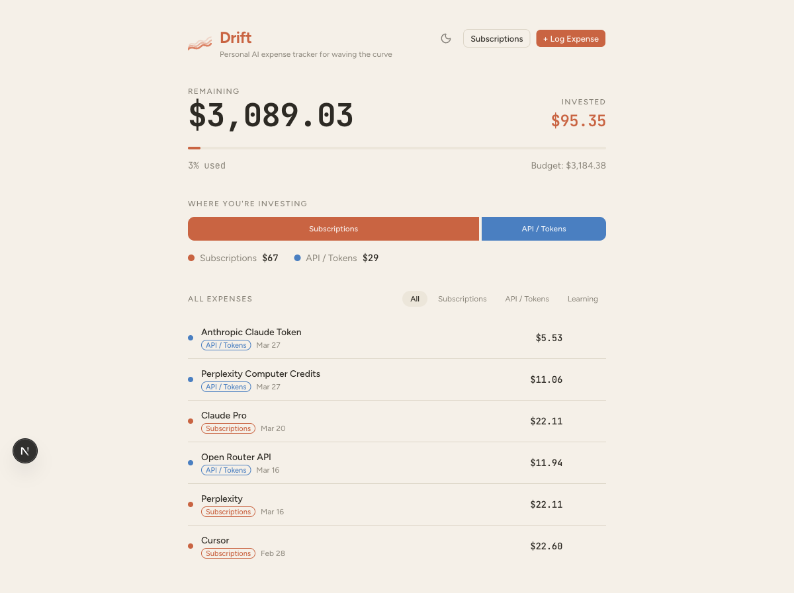

# Drift

Personal AI expense tracker for waving the curve.



## Why

I set aside $3,000 to invest in learning AI — subscriptions, API credits, courses, newsletters. Drift tracks where that money goes and how much is left, so I can be intentional about exploring without overthinking every purchase.

## Features

- Budget overview with remaining/invested amounts
- Category breakdown (Subscriptions, API/Tokens, Learning)
- Full expense log with filter, edit, and delete
- Recurring subscriptions with renewal reminders
- Configurable budget amount
- Light/dark theme toggle
- Postgres persistence (Prisma + Neon)

## Stack

Next.js 16 &middot; TypeScript &middot; Tailwind CSS &middot; shadcn/ui &middot; Framer Motion &middot; Prisma &middot; Postgres

## Getting Started

```bash
pnpm install
cp .env.example .env
pnpm db:push
pnpm dev
```

Open [http://localhost:3000](http://localhost:3000).

## Database Setup

1. Create a Postgres database (Neon recommended for Vercel).
2. Set `DATABASE_URL` in `.env` locally.
3. Run `pnpm db:push`.

For Vercel: add `DATABASE_URL` in Project Settings → Environment Variables, then redeploy.

## License

MIT
